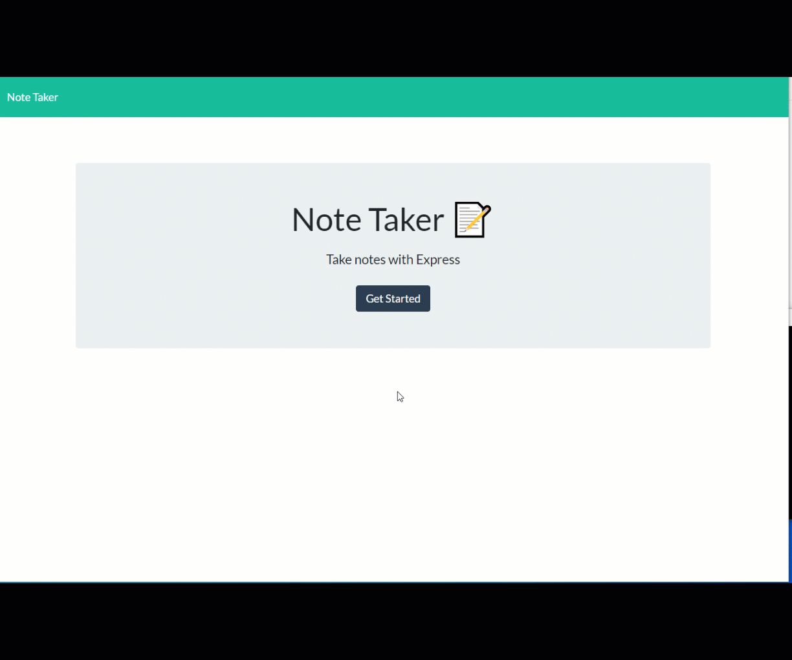

# notetaker

Note take application

## Current Issues

    - issue deploying to heroku currently

## About / Synopsis

- This is the 11th home work assignment.
- Simple note taker - built the backend, front end was provided
- How note take works :

  - When page loads, any notes that were saved are pulled from json file and added to notes on left
  - Clicking the trashcan will remote a note
  - Clicking the pencil will create a new note, then adding text and click save will save that note
  - Notes are saved in a json file

- How to Run Applicaton:
  1. Open CLI
  2. Run npm install
  3. cd to development folder and type node server.js to start CLI prompts

## Toolset involved

    * HTML
    * CSS
    * Java Script
    * Boostrap
    * node.js

## GIF shot running team builder, output, and then tests at end

